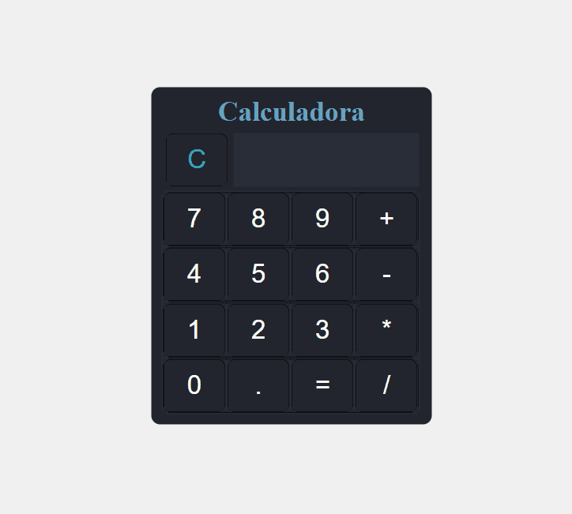

# Calculadora

<h4 align= "center"> 📝 Calculadora </h4>

<h1 align="center">
 

## ✨Tecnologias
 Este projeto foi desenvolvido com as seguintes tecnologias:
- [JavaScript](https://developer.mozilla.org/pt-BR/docs/Web/JavaScript)
- [HTML](https://devdocs.io/html/)
- [CSS](https://devdocs.io/css/)
- [vscode](https://code.visualstudio.com/)

## 🚀 Como executar

- Clone o repositório
- Abra o arquivo index.html

Agora você pode acessar a calculadora do seu navegador.

